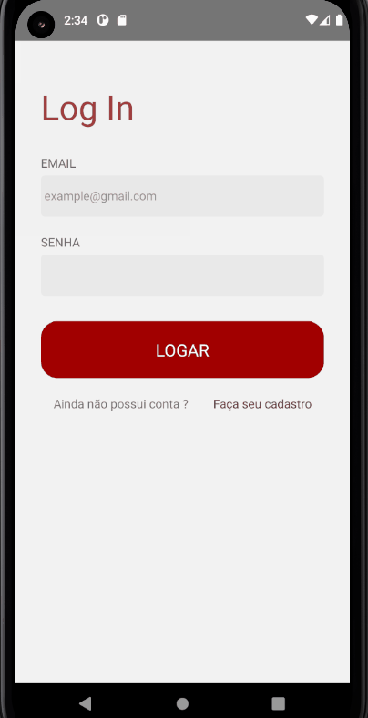

# Meat Club App

## 🎯 Sobre o projeto
Um aplicativo para fazer assinaturas de planos de carne online para entregar mensalmente no conforto da sua casa.

## ⛏ Desenvolvimento
O aplicativo foi desenvolvido em duas semanas com uma equipe de 4 integrantes para apresentação do segundo semestre do curso técnico de desenvolvimento de sistemas do SENAI. 

Foi usado metodologia ágil Kanban usando a ferramenta Trello para dividir as tarefas, gerenciar a equipe, as atividades, prazo da entrega do projeto e os dias. 

Foi usado Figma para prototipagem das telas recebendo mais de 10 feedbacks de clientes.

## 💻 Tecnologias
✔ React Native
